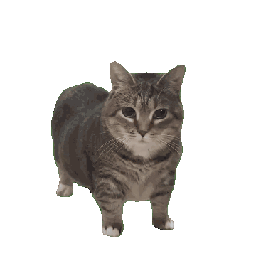

---

## About Me

<table>
<tr>
<td width="30%" align="center">
  
</td>
<td width="70%">

### Hey there! I'm Fatih 👋

I'm a **14-year-old student from Indonesia** with a strong passion for technology and programming. I'm still learning the fundamentals, but I have solid basics in web development and I'm committed to improving my skills every day.

**Currently, I'm focused on:**
- Learning **fundamental**
- Building **small projects** to apply what I've learned
- Understanding **best practices** in coding and design
- Exploring different areas of tech to find what interests me most

I'm looking for **opportunities to grow** — whether through mentorship, scholarships, or collaborative projects where I can contribute and learn simultaneously.

</td>
</tr>
</table>

---

## My Skills & Tools

### TECHSTACK

#### 🎨 Frontend

  
  
  
  
  

#### 💻 Backend & Tools

  
  
  

#### 🎯 Design

  

## Activity & Progress

<table>
<tr>
<td align="center">
  <strong>🔥 Streak Stats</strong> 
  
</td>
</tr>
</table>

---

## Contributions

  

---

## Get in Touch

Feel free to reach out if you'd like to collaborate, mentor, or discuss opportunities:

---

**Let's build something great together.**  
*Code is how I learn. Every day is a chance to get better.*

