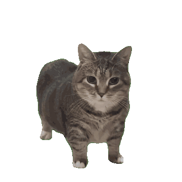

<div align="center">

<picture>
  <source media="(prefers-color-scheme: dark)" srcset="https://readme-typing-svg.demolab.com?font=JetBrains+Mono&weight=600&size=24&duration=3000&pause=1000&color=8B5CF6&center=true&vCenter=true&width=580&lines=Learning+Data+Science+%26+AI;Starting+from+zero%2C+building+up;Curious+today%2C+capable+tomorrow" />
  
</picture>

<br />


<a href="https://instagram.com/ftihrbb">
  
</a>

</div>

---

## 🙋‍♂️ About Me

<table>
<tr>
<td width="28%" align="center">
  
</td>
<td width="72%">

I'm a **14-year-old student from Indonesia**, and I'm building my way into **Data Science and AI**.

I'm early in the journey — right now that means Python, notebooks, and learning how to actually make sense of data. I'd rather be honest about being a beginner than pretend otherwise. What I do have is consistency: I show up and learn something every day.

```yaml
name:      Fatih
age:       14
location:  Indonesia 🇮🇩
focus:     Data Science · Machine Learning · AI
doing:     Python fundamentals, notebooks, small datasets
seeking:   mentorship · scholarships · study partners
```

> Beginner is a starting point, not a label.

</td>
</tr>
</table>

---

## 🧪 Learning Stack

<div align="center">

*Everything here is a work in progress — this is what I'm actively learning, not what I've mastered.*

| | |
|:--|:--|
| **Language** |  |
| **Notebook** |  |
| **Data** |   |
| **Visualization** |   |
| **Machine Learning** |   |
| **Tools** |    |

</div>

---

## 🐍 Contributions

<div align="center">

<picture>
  <source media="(prefers-color-scheme: dark)" srcset="https://raw.githubusercontent.com/ftihrbb/ftihrbb/output/github-contribution-grid-snake-dark.svg" />
  
</picture>

</div>

---

## 📬 Get in Touch

<div align="center">

I'd love to hear from you — especially if you work in **data or AI** and are open to mentoring someone just starting out.

<a href="https://instagram.com/ftihrbb">
  
</a>
<a href="https://github.com/ftihrbb">
  
</a>

<br /><br />

**Let's build something great together.**

</div>


